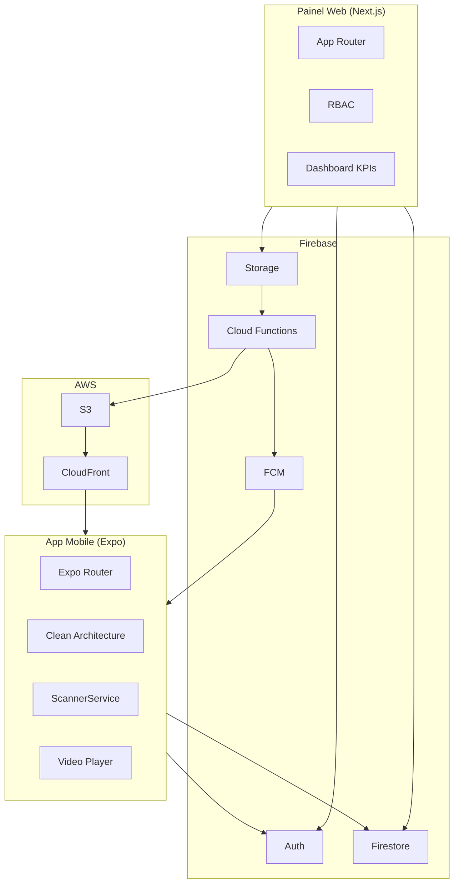

# Arquitetura — Heróis dos Prêmios

## Visão Geral

## Escalabilidade (Milhões de Registros)

- **Firestore indexes compostos** configurados para queries frequentes
- **Paginação cursor-based** via `startAfter` (shared constants: DEFAULT_PAGE_SIZE)
- **Denormalização** de `coinBalance` no documento `users`
- **Cloud Functions** para writes críticos (moedas, transações)
- **CDN CloudFront** para entrega de vídeos (sem carga no Firebase Storage)
- **Rate limiting** configurável via env vars

## Integrações Futuras

### Vuforia (Reconhecimento Visual)

- Interface: `IScannerService.scanVisualRecognition()`
- Implementação: `ScannerService` em `infrastructure/scanner/`

### IA (Legendas)

- Placeholder em `video-processing.service.ts`
- Integrar: Google Speech-to-Text ou OpenAI Whisper API
